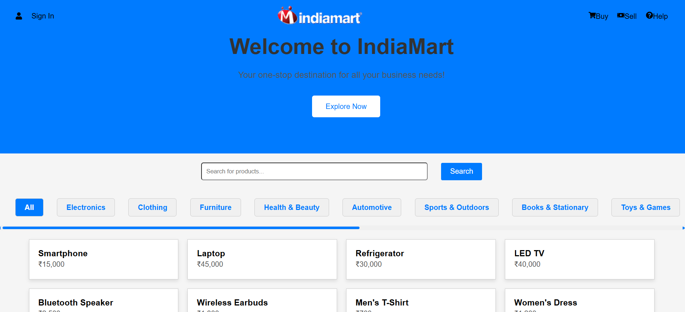
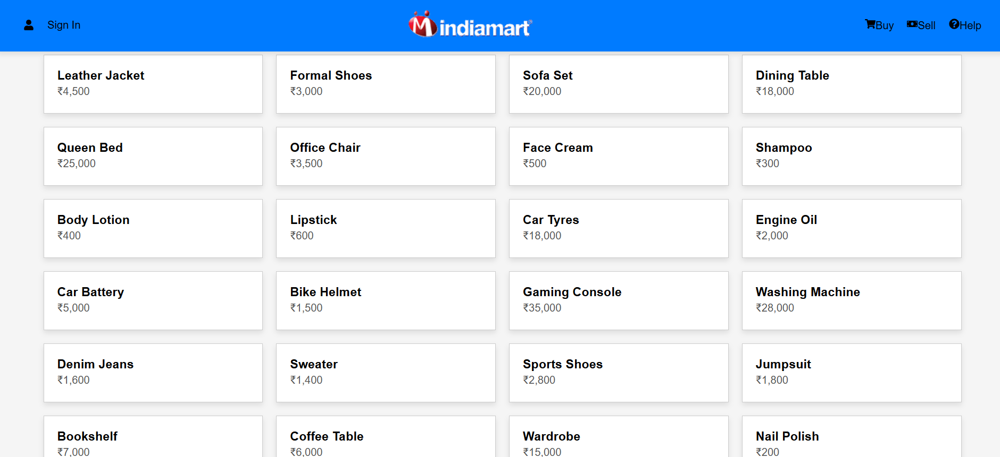
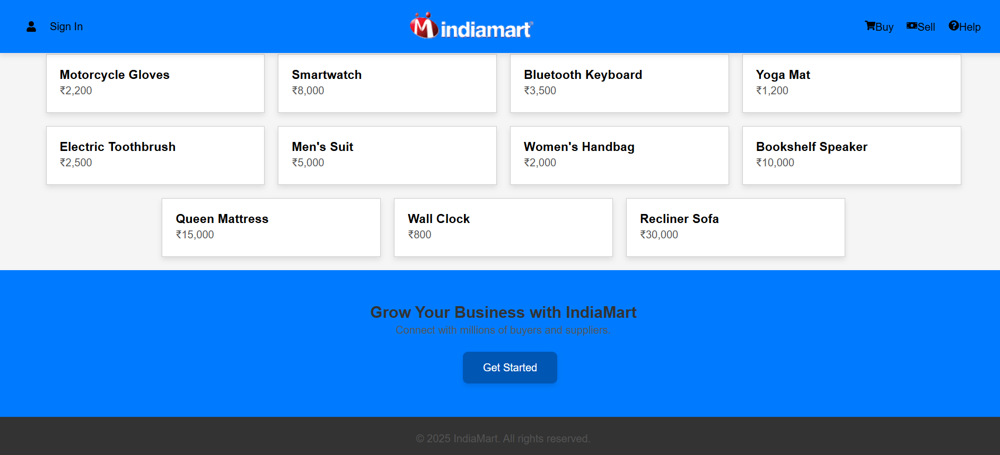
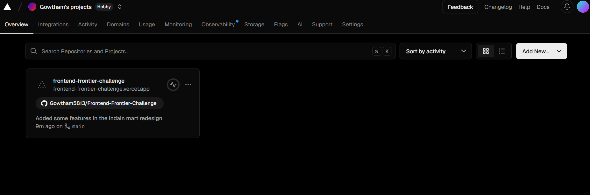

#Project Name:
India Mart Redesign

#Project Description :
India Mart Redesign is a modern, responsive redesign of the India Mart e-commerce platform. 
It focuses on improving the user interface and user experience with enhanced visual elements,
better navigation, and optimized performance. The project aims to provide a seamless browsing
experience for users to explore products and services.

#Tech Stack :
Frontend: React,CSS,JSX,HTML

Framework: React.js

State Management: Context API  

Deployment: Vercel 

#Features :
1.Clean and intuitive UI

2.Responsive design across devices

3.Enhanced product listing and search functionality

4.Interactive components for better user engagement

5.Optimized loading times

6.Local storage for maintaining user preferences

#Installation Instructions :
Clone the repository:

git clone https://github.com/Gowtham5813/Frontend-Frontier-Challenge.git

Navigate to the project directory:

cd india-mart-redesign

Install dependencies:

npm install

Start the development server:

npm run dev
Open your browser and go to http://localhost:5173/

How to Run:
Ensure Node.js is installed.

Follow the installation instructions above.

Run npm start to view the application in your browser.

Deployment Link :
India Mart Redesign - "(https://frontend-frontier-challenge-7xwb5alti.vercel.app/)"

Screenshots :
  
  
  
  
  

